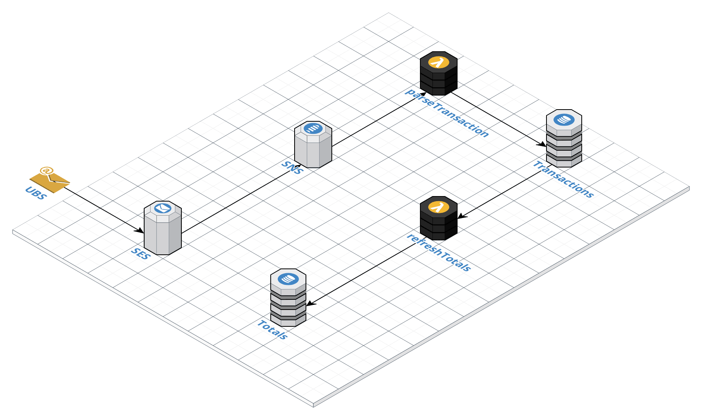
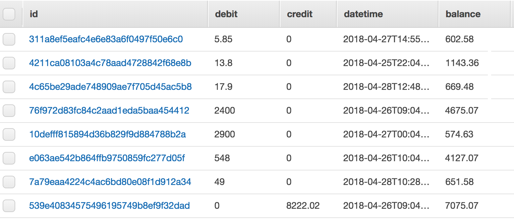
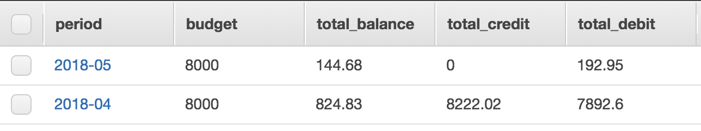
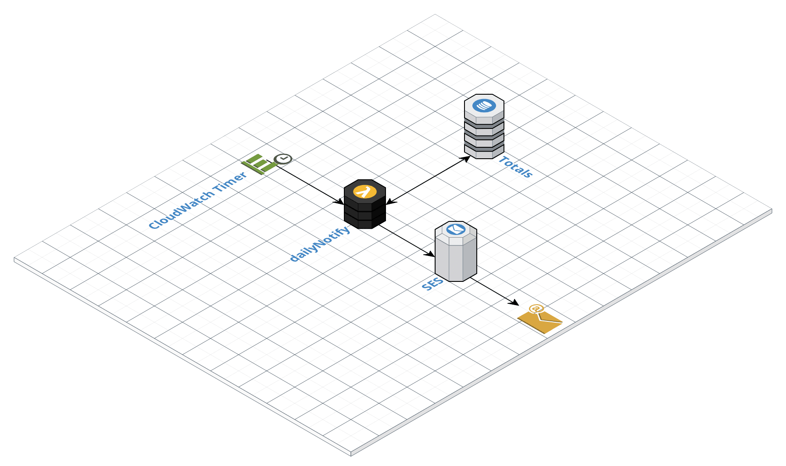
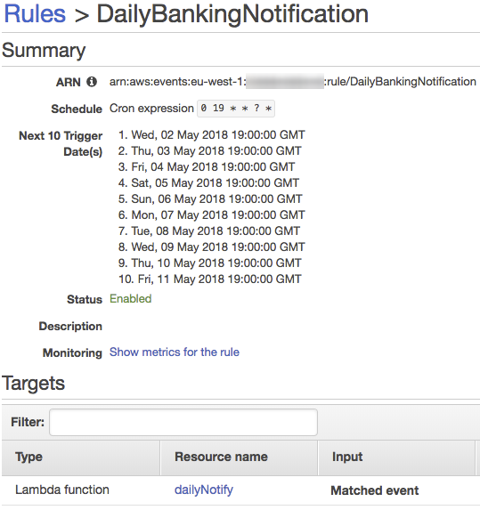
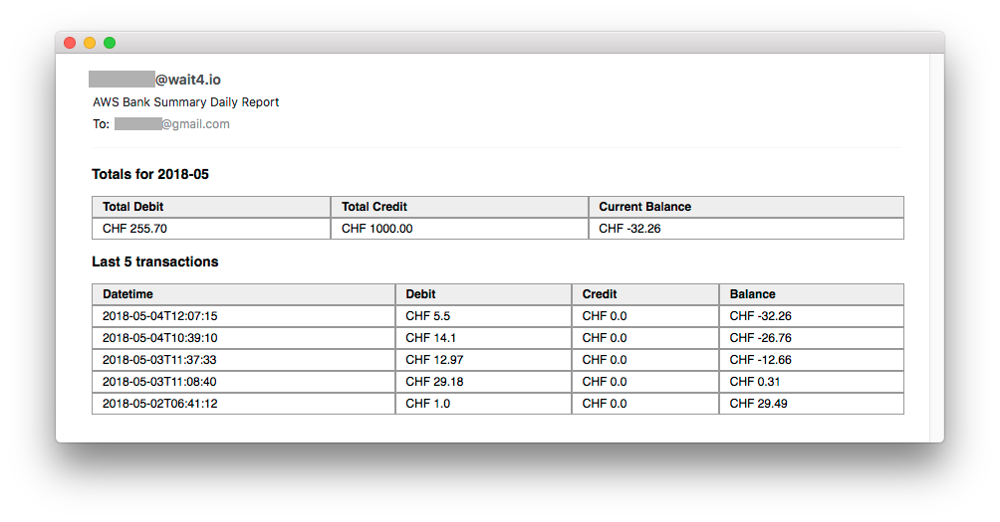

### Purpose

I'm one of those people that never carries cash on me. Well, almost never.

Switzerland is heading well towards a cashless society. But, there are still many places that either won't accept cards (👎 tax cheaters) or they accept under certain conditions like you have to buy for at least X amount.

How do I track my debit card spendings?

My bank, like many other banks today, provides e-banking services and occassionally, I check the balance on my phone &mdash; using the UBS app. For more advanced money/budget management, there's tons of other apps and websites, which I won't cover in this post.

The "problem" with the above is it takes time and consistency to build up a habit. And things can get even more complicated when you have joint accounts & debit/credit cards.

I figured, it would be cool to get daily notifications, informing me of my spendings and balance for the current month.
Obviously, achieving something like this could've been an easy project if banks had public/free-to-use APIs. Or if it was possible to login programatically (aka headless browsing), which anyway won't work due to required two-factor authentication. Luckily for me, UBS offers email/SMS/push notifications.


*Source: ubs.com*

That's the kind of data I could store for future analysis. Question is how and where? Hence, the aim of this post is twofold: 1) enable email notifications in my bank 2) parse the data and store it in some kind of a database.

### Required AWS components

> Over-engineering alert: I could've achieved same results with a Python script but where is fun in that?

There is a multitude of [services available in AWS](https://docs.aws.amazon.com/aws-technical-content/latest/aws-overview/aws-overview.pdf) and I will probably add more components in future but for now, I just need these five:

* [SES](https://aws.amazon.com/ses/) &mdash; Email Sending and Receiving
* [SNS](https://aws.amazon.com/sns/) &mdash; SNS Pub/Sub, Mobile Push and SMS
* [Lambda](https://aws.amazon.com/lambda/) &mdash; Run Code without Thinking about Servers
* [CloudWatch](https://aws.amazon.com/cloudwatch/) &mdash; Monitor Resources and Applications
* [DynamoDB](https://aws.amazon.com/dynamodb/) &mdash; Managed NoSQL Database

The logic flow is pretty simple:



1. Receive notification from the bank (SES)
2. Pass it on to the topic subscriber (SNS)
3. Extract timestamp, transaction amount and balance (Lambda)
4. Store results in the DB (DynamoDB)

### Receiving Messages

Simple Email Service (SES) is a service for receiving and sending emails. Upon receiving a message, SES can trigger actions as specified: save the message in S3, run a Lambda function, send the message to SNS etc.  

In order to receive notifications from the bank, my domain's MX record has to point to the SES inbound server in my region.

```shell
$ dig +short mx wait4.io
10 inbound-smtp.eu-west-1.amazonaws.com.
```

The domain is also hosted on [Route 53](https://aws.amazon.com/route53/), so SES can automatically update the zone with required TXT and MX values, which saves me some time.

The SES receipt *bank_alerts* rule is configured to publish messages (received on bogus@wait4.io) to *ubs_events* topic in SNS:

```shell
aws> ses describe-active-receipt-rule-set
{
    "Rules": [
        {
            "Name": "bank_alerts",
            "Recipients": [
                "bogus@wait4.io"
            ],
            "Enabled": true,
            "ScanEnabled": true,
            "Actions": [
                {
                    "SNSAction": {
                        "TopicArn": "arn:aws:sns:eu-west-1:0123456789:ubs_events",
                        "Encoding": "UTF-8"
                    }
                }
            ],
            "TlsPolicy": "Optional"
        }
    ],
    "Metadata": {
        "CreatedTimestamp": "2018-04-22T18:39:30.726Z",
        "Name": "default-rule-set"
    }
}
```

### Message Processing

When a new message is published in *ubs_events*, Lambda invokes the *parseTransaction* function. The function serves two purposes: parse the message and store the data in the database.

```python
from datetime import datetime
import json
import re
import uuid
import boto3

def lambda_handler(event, context):
    msg = json.loads(event['Records'][0]['Sns']['Message'])

    data = msg['content']
    trn = parse_data(data)

    if trn is not None:
        parse_transaction(trn)
```

Parsing is done in *parse_data* and the format of the received message comes in two variations &mdash; one for each transaction type:

> Debit of CHF 100.00 from account "Checking". New account balance: CHF 5'775.84.

Or:

> Credit of CHF 100.00 to account "Checking". New account balance: CHF 5'775.84.

Unnecessary characters are removed and the data is matched with a regex to establish whether the message contains information about the transaction.

```python
def parse_data(data):
    data = data.replace('=\r\n', '').replace('\'', '')
    match = re.search(r'\w+ of CHF (.*) \w+ account \"Checking\". New account balance: CHF (.*)\.', data, re.M)

    if match:
        if 'Debit' in data:
            debit = match.group(1)
            credit = 0.00
        elif 'Credit' in data:
            credit = match.group(1)
            debit = 0.00
        balance = match.group(2)
        
        return {'datetime': datetime.now().isoformat(),
                'debit': format(float(debit), '.2f'),
                'credit': format(float(credit), '.2f'),
                'balance': format(float(match.group(2)), '.2f')}
    else:
        return None
```

The end result contains five keys that are inserted into the *Transactions* table. The method returns a hash table with the transaction amount, debit, credit, balance and the datetime of the transaction. This data is then forwarded to the *parse_transaction* method.

```python
def parse_transaction(trn):
    ddb = boto3.client('dynamodb')
    trn_id = uuid.uuid4().hex

    ddb.put_item(
        TableName = 'Transactions',
        Item = {'id': {'S': trn_id},
              'datetime': {'S': trn['datetime']},
              'debit': {'N': trn['debit']},
              'credit': {'N': trn['credit']},
              'balance': {'N': trn['balance']}})
```

Every transaction in the table is identified by a unique ID that is generated by the *uuid* library.


*Note: figures are not real for obvious reasons*

### Budget Update

The purpose of each key in the *Totals* table is pretty explanatory.

* `budget` &mdash; pre-defined value
* `total_balance` &mdash; available on account MTD
* `total_credit` &mdash; total to-account operations MTD
* `total_debit` &mdash; total from-account operations MTD

At any given time, I want to know all these values. Every time a new transaction is recorded, the totals also get updated. UBS allows to configure the notifications so that the remaining balance is included in the message but if it wasn't the case, I would've had to calculate the available balance by subtracting debit and adding credit to the budget.

Such approach requires the sums to get calculated on each request. For my personal use, it's not a problem, but in particular circumstances, it also means I have a limitation caused by DynamoDB. To calculate the amount of *N* transactions, *N* records need to be read, so *N* read capacity units need to be spent. Obviously, such solution is not scalable as it leads to greater complexity (and higher cost) in as few as several dozen transactions.

In my case, the total balance is updated after each transaction and is always up-to-date, which reduces the necessity of summing each and every transaction. The total is updated when the *updateTotals* Lambda detects a change in the *Transactions* table. The approach makes sense when considering multi-threading.

```python
from datetime import datetime
import boto3
from dateutil.parser import parse

def lambda_handler(event, context):
    for record in event['Records']:
        if record['eventName'] != 'INSERT':
            print('Unsupported event {}'.format(record))
            return

        trn = record['dynamodb']['NewImage']
        print(trn)

        parse_transaction(trn)
```

In this function, only *INSERT* operations are relevant, and others are ignored.

```python
def parse_transaction(trn):
    period = get_period(trn)
    if period is None:
        return

    debit = trn['debit']['N']
    credit = trn['credit']['N']
    balance = trn['balance']['N']

    refresh_totals(period, debit, credit, balance)
```

The period is calculated in *YEAR-MONTH* format, and the *refresh_totals* method is called.

```python
def get_period(trn):
    dt = parse(trn['datetime']['S'])

    return dt.strftime('%Y-%m')
```

The refresh totals part:

```python
def refresh_totals(period, debit, credit, balance):
    ddb = boto3.client('dynamodb')

    response = get_totals(ddb, period)

    if 'Item' not in response:
        create_totals(ddb, period, debit, credit, balance)
    else:
        total_debit = response['Item']['total_debit']['N']
        total_credit = response['Item']['total_credit']['N']
        total_balance = response['Item']['total_balance']['N']

        update_totals(ddb,
            period,
            total_debit, debit,
            total_credit, credit,
            total_balance, balance)
```

In this method, the *Totals* for the current period are loaded using *get_totals*, in which the they are updated. If *Totals* do not exist, they get created with *create_totals*. If already there, they are updated with *update_totals*.

```python
def get_totals(ddb, period):
    return ddb.get_item(TableName = 'Totals',
        Key = {'period': {'S': period}},
        ConsistentRead = True)
```

As the *Totals* update can be carried out from several threads, consistent reading is important. While it's more expensive, DynamoDB uses strongly consistent reads during the operation.

```python
def create_totals(ddb, period, total_debit, total_credit, total_balance):
    ddb.put_item(TableName = 'Totals',
        Item = {'period': {'S': period},
                'total_debit': {'N': total_debit},
                'total_credit': {'N': total_credit},
                'budget': {'N': '8000'},
                'total_balance': {'N': total_balance}},
        ConditionExpression = 'attribute_not_exists(period)')
```

When a new *Totals* entry is created, a *ConditionExpression* is specified in case of simultaneous requests from multiple threads. `attribute_not_exists(period)` will save a new *Totals* only if it doesn't exist.
Therefore, if somehow another *Totals* is created in the interim (when attempted to load it into *load_totals* and it wouldn't exist, and when attempted to create it using *create_totals*), the *put_item* call will result in an exception, forcing the entire Lambda function to restart.

```python
def update_totals(ddb, period, total_debit, debit, total_credit, credit, total_balance, balance):
    ddb.update_item(TableName = 'Totals',
        Key = {'period': {'S': period}},
        UpdateExpression = 'SET #total_debit = #total_debit + :debit, #total_credit = #total_credit + :credit, #total_balance = :balance',
        ConditionExpression = '(#total_debit = :total_debit) and (#total_credit = :total_credit) and (#total_balance = :total_balance)',
        ExpressionAttributeNames = {
            '#total_debit': 'total_debit',
            '#total_credit': 'total_credit',
            '#total_balance': 'total_balance'},
        ExpressionAttributeValues = {
            ':debit': {'N': debit},
            ':total_debit': {'N': total_debit},
            ':credit': {'N': credit},
            ':total_credit': {'N': total_credit},
            ':balance': {'N': balance},
            ':total_balance': {'N': total_balance}})
```

The value of *total_debit* is updated in the *Totals* table:

```bash
UpdateExpression = 'SET #total_debit = #total_debit + :debit'
```

Above *UpdateExpression* is probably sufficient (security wise) for this update, but I decided to be pragmatic. In doing so, I added a *ConditionExpression* instructing DynamoDB that the record should be updated only if the *Totals* was not updated in another thread, and it would also still contain the passed value:

```bash
ConditionExpression = '(#total_debit = :total_debit)'
```

The final update looks something like this:


*Note: figures are not real for obvious reasons*

### Totals Notifications

The final part of the setup is to get daily reports and the notification flow is similarly quite simple:



I configured *CloudWatch Timer* to trigger *dailyNotify* Lambda function, daily at 19:00 GMT.



The *load* functions retrieve the data from the DynamoDB tables while the *make_html* functions return the HTML code.

```python
import boto3
import decimal
from datetime import datetime
from operator import itemgetter

def load_summary(ddb, period):
    result = ddb.get_item(TableName = 'Totals',
        Key = {'period': {'S': period}},
        ConsistentRead = True)

    return result

def load_last_transactions(ddb, num_trans=5):
    table = ddb.scan(TableName = 'Transactions')

    entries = []
    for i in table['Items']:
      i['datetime']['S'] = datetime.strptime(i['datetime']['S'], '%Y-%m-%dT%H:%M:%S.%f')
      entries.append(i)

    result = sorted(entries, key=itemgetter('datetime'), reverse=True)

    return result[:num_trans]

def make_transactions_html(data):
    html_start = '''
            <h3>Last 5 transactions</h3>
            <div class="divTable">
                <div class="divTableHeading">
                    <div class="divTableRow">
                        <div class="divTableHead">Datetime</div>
                        <div class="divTableHead">Debit</div>
                        <div class="divTableHead">Credit</div>
                        <div class="divTableHead">Balance</div>
                    </div>
                </div>'''

    html_rows = ''
    for trn in data:
        html_rows += '''
                <div class="divTableRow">
                    <div class="divTableCell">{}</div>
                    <div class="divTableCell">CHF {}</div>
                    <div class="divTableCell">CHF {}</div>
                    <div class="divTableCell">CHF {}</div>
                </div>'''.format('{:%Y-%m-%dT%H:%M:%S}'.format(trn['datetime']['S']),
                    float(trn['debit']['N']),
                    float(trn['credit']['N']),
                    float(trn['balance']['N']))

    html_end = '''
            </div>'''

    return '{}{}{}'.format(html_start, html_rows, html_end)

def make_summary_html(data, period):
    html = '''
            <h3>Totals for {0}</h3>
            <div class="divTable">
                <div class="divTableHeading">
                    <div class="divTableRow">
                        <div class="divTableHead">Total Debit</div>
                        <div class="divTableHead">Total Credit</div>
                        <div class="divTableHead">Current Balance</div>
                    </div>
                </div>
                <div class="divTableRow">
                    <div class="divTableCell">CHF {1:.2f}</div>
                    <div class="divTableCell">CHF {2:.2f}</div>
                    <div class="divTableCell">CHF {3:.2f}</div>
                </div>
            </div>'''.format(period,
                    float(data['Item']['total_debit']['N']),
                    float(data['Item']['total_credit']['N']),
                    float(data['Item']['total_balance']['N']))

    return html

def lambda_handler(event, context):
    ddb = boto3.client('dynamodb')

    current_period = datetime.today().strftime('%Y-%m')

    summary_result = load_summary(ddb, current_period)
    transactions_result = load_last_transactions(ddb)

    summary_html = make_summary_html(summary_result, current_period)
    transactions_html = make_transactions_html(transactions_result)

    send_email(summary_html, transactions_html)
```

Finally, the html code is passed to the email function.

```python
def send_email(totals_html, transactions_html):
    client = boto3.client('ses', region_name = 'eu-west-1')

    MAIL_FROM = 'bogus@wait4.io'
    MAIL_TO = ['bogus@gmail.com']
    SUBJECT = 'AWS Bank Summary Daily Report'

    HTML_BODY = '''<html>
    <head>
    <style>
    .divTable {{
      display: table;
      width: 100%;
    }}
    .divTableRow {{
      display: table-row;
    }}
    .divTableCell, .divTableHead {{
      border: 1px solid #999999;
      display: table-cell;
      padding: 3px 10px;
    }}
    .divTableHeading {{
      background-color: #EEE;
      display: table-header-group;
      font-weight: bold;
    }}
    .divTableBody {{
      display: table-row-group;
    }}
    </style>
    </head>
    <body>
    {0}
    {1}
    </body>
    </html>'''.format(totals_html, transactions_html)

    response = client.send_email(
        Destination = {
            'ToAddresses': MAIL_TO
        },
        Message = {
            'Body': {
                'Html': {
                    'Charset': 'UTF-8',
                    'Data': HTML_BODY,
                },
            },
            'Subject': {
                'Charset': 'UTF-8',
                'Data': SUBJECT,
            },
        },
        Source = MAIL_FROM)
```

### Thoughts

That's it for now! Once a transaction occurs, the received message is processed, totals are updated, and a report is sent at the end of the day.


*Note: figures are not real for obvious reasons*

I have more plans to extend functionality such as including merchant information and spendings per cost categories. It would also be great to produce some visuals using D3.js or similar, but I'll make a new post for that.

Stay tuned and thanks for reading! 🙌

[@norus](https://twitter.com/norus)
