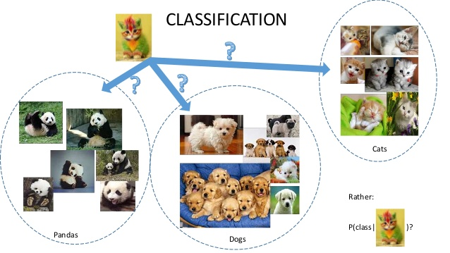
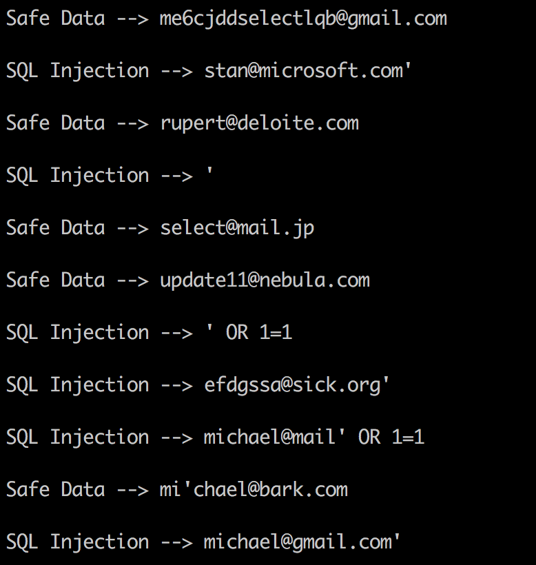

### Introduction

I wanted to share my first experience with machine learning (using Python libraries).

For starters, I went ahead and read [ML for Beginners](https://www.tensorflow.org/get_started/get_started_for_beginners)
 \+ [TensorFlow for Beginners](https://www.tensorflow.org/get_started/premade_estimators) to get a general idea of 
 what ML is.

[TensorFlow](https://www.tensorflow.org) was developed by Google. It is considered to be one of the most popular 
libraries for machine learning and has support for Python, Java, C++, Go. Additionally, TensorFlow can run on 
(multiple) GPUs for heavy computational tasks.

[scikit-learn](http://scikit-learn.org/stable/) is another library that is used a lot in Python based environments. The 
advantage of this library is you get ready-to-use algorithms, which you basically import and start creating magic.

My goal when writing this post was to train my model so it can recognize SQL injections in a given input.

> Yes, I could've done it with a regex but where is fun in that?

### Data sets

I'm going to tackle [classification](https://en.wikipedia.org/wiki/Classification_in_machine_learning),
i.e. the algorithm, once fed with data, should predict the respective category aka its class label.


*Source: https://guide.freecodecamp.org*

Data used for algorithm’s search for regularities is called *features*. The categories which include features are 
called *labels*. It’s important to note that input data can have several features but only one label.

I used [supervised learning](https://en.wikipedia.org/wiki/Supervised_learning) .
This means that the algorithm will receive both features and labels in the process of learning.

The first step at solving any task using machine learning is collecting data to train the machine. In an ideal world, 
it should be real data. Unfortunately, I could not find anything suitable for the purpose of my tests. So I wrote a 
script to generate random email addresses and examples of SQL injections. In my CSV file, I got three types of data: 
random emails (30'000), random emails with SQL injections (30'000) and pure SQL injections (20'000). The final result 
looked something like this:

<details>
 <summary>Data set sample</summary>

| A | B |
| -----------------------------------------------|------------:|
| te9q32nncr3@skfa.info                          | 0           |
| i10tkwudyb@p7d366hsai.info                     | 0           |
| lkm406e@xkx77jbjx1rd.de                        | 0           |
| jm8uuuw1v4os@0g56v.org                         | 0           |
| pf2yzx@huow3dexl7kd.uk                         | 0           |
| jj09x952x@032q.ca                              | 0           |
| usd1013vj@326i0iox2vf.com                      | 0           |
| a854d7ch390@ty525pra.info                      | 0           |
| ujsurx@w1eiur3.net'                            | 1           |
| qzvrbOSpt@h5507q.net'; SET                     | 1           |
| igq5910xyw4@mttufr0281d5.kz'; INSERT           | 1           |
| dqmsw23k25h@v8hjdr1mkb5.eu'                    | 1           |
| zrx7d0@atwivx.kz'; SET                         | 1           |
| mnkmoOng@1lutlwm4bvfd.com'\                    | 1           |
| l08ttiuuupn@dvpg8y.info'; DROP TABLE users; -- | 1           |
| ' 0R 'x'='x'                                   | 1           |
| '; DROP                                        | 1           |
| ';                                             | 1           |
| ';                                             | 1           |
| '; SET                                         | 1           |

</details>
&nbsp;

Now it’s time to calculate the data. The function below returns list *X* containing features, list *y* containing 
labels for each feature, and list *labels* containing textual definitions for labels. The latter is used for the sake of 
outputting the results.

```python
def get_dataset():
   X, y = [], []
   labels = ['safe_data', 'sql_injection']
   
   with open('data_set.csv') as cfile:
       readc = csv.reader(cfile, delimiter='\n')
       for row in readc:
           splitted = row[0].split(',')
           X.append(splitted[0])
           y.append(splitted[1])

   return X, y, labels
```

Next, the data is divided into training and testing sets. The function *cross\_validation.train\_test\_split()*
 is going to take care of that. It will shuffle the records and return four sets of data: two training sets and two 
testing sets for features and labels.

```python
X_train, X_test, y_train, y_test = cross_validation.train_test_split(X, y, test_size=0.2, random_state=0)
```

After that, a *vectorizer* object is initialized, which will 1) read the provided data one symbol at a time, 2) combine 
them into [*n*-grams](https://en.wikipedia.org/wiki/N-gram) and 3) translate them into numeric vectors.
 
```python
vectorizer = feature_extraction.text.TfidfVectorizer(ngram_range=(1, 4), analyzer='char')
```

### Data feed

In the next step, I initialize a *pipeline* and pass the previously created *vectorizer* object to it. The second 
parameter is the algorithm to be used for the data set analysis. In my case, I'm going to use the 
[Logistic regression algorithm](https://en.wikipedia.org/wiki/Logistic_regression).

```python
pipe = pipeline.Pipeline([('vectorizer', vectorizer), ('clf', linear_model.LogisticRegression())])
```

The model is ready to digest the data. Now I simply pass the feature and label training sets to the pipeline and the 
model starts learning. With the next line, I use *predict()* to get the amount of correctly predicted data.

```python
pipe.fit(X_train, y_train)
y_predicted = pipe.predict(X_test)
```

In order to know how precisely the model can predict, I compare the predicted data with the testing list for labels.

```python
metrics.classification_report(y_test, y_predicted, target_names=labels)
```

The model’s accuracy is measured from 0 to 1. It can also be measured using percentage values. This model returns 
100% correct answers. 
Of course, it’s not that easy to reach such accuracy using real data, and the example task I used is quite simple.

|                | Precision | Recall   | F1-Score | Support   |
| --------------:|----------:|---------:| --------:| ---------:|
| safe_data      | 0.99      | 1.00     | 1.00     | 3981      |
| injected_mail  | 1.00      | 1.00     | 1.00     | 6019      |
| **avg/total**  | **1.00**  | **1.00** | **1.00** | **10000** |

The final step is to save the model in its trained state so that it can be (re)used without having to retrain it. 
Here, I serialize the model in a Python pickle object by using this built-in function in Scikit-learn:

```python
joblib.dump(pipe, 'inj_model.pickle')
```

Example of reusing the serialized model in another program.

```python
import numpy as np
from sklearn.externals import joblib

clf = joblib.load('inj_model.pickle')

data = ["me6cjddselectlqb@gmail.com",
        "stan@microsoft.com'",
        "rupert@deloite.com"
        "'",
        "select@mail.jp",
        "update11@nebula.com",
        "' OR 1=1",
        "efdgssa@sick.org'",
        "michael@mail' OR 1=1",
        "mi'chael@bark.com",
        "michael@gmail.com'"]

predicted_attacks = clf.predict(data).astype(np.int)
labels = ['Safe Data', 'SQL Injection']

for email, item in zip(data, predicted_attacks):
    print labels[item], '-->', email
```

The result looks like this:



### Conclusion

So there you go: I have trained my model and it does the job quite well. A practical example case could be putting this 
somewhere on the backend and log or trigger actions when injections are detected.

These were my first steps in machine learning and I hope I inspired those of you who wanted to start playing with ML 
but were too afraid to touch it.

Where to go from here? I suggest a great series of articles on Medium called 
[Machine Learning is Fun!](https://medium.com/@ageitgey/machine-learning-is-fun-80ea3ec3c471)

Stay tuned and thanks for reading! 🙌

[@norus](https://twitter.com/norus)